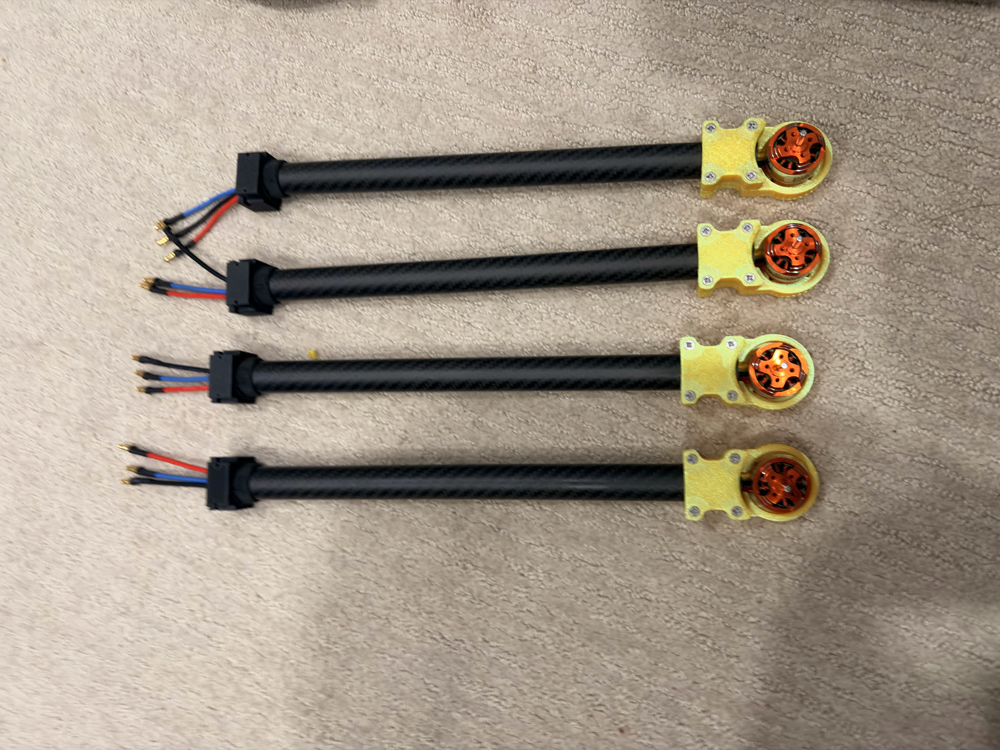
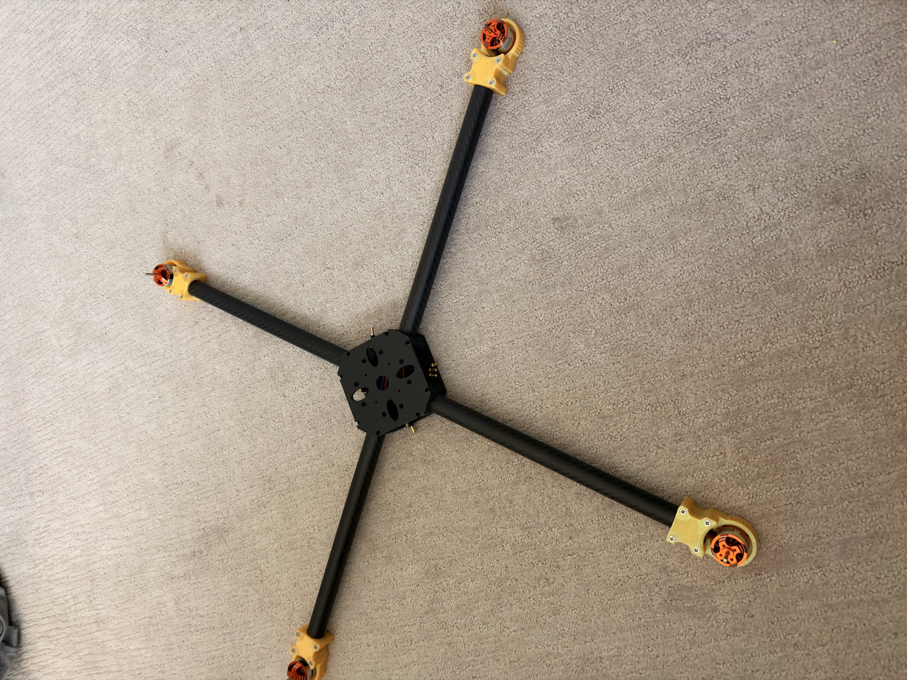
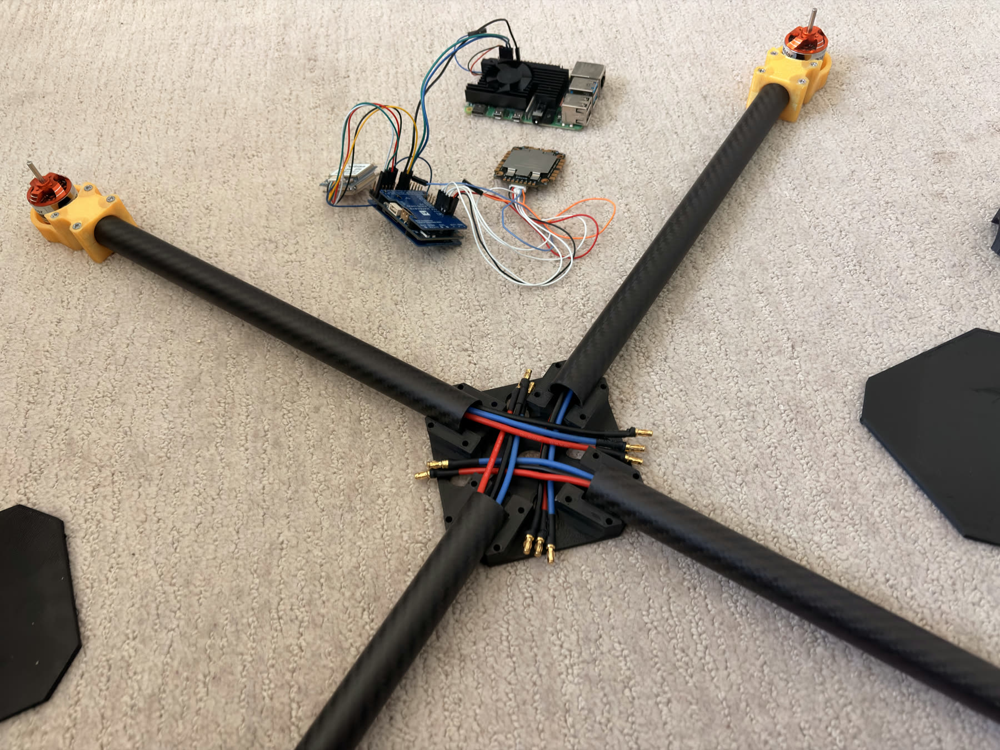

# Build Guide

Complete step-by-step assembly guide from unboxing to first flight.

## Prerequisites

- All components from the [Bill of Materials](../hardware/bill-of-materials.md) received and verified
- Soldering iron (temperature-controlled, 350-380C)
- Wire strippers, multimeter, heat gun
- Clean, flat workspace with good lighting
- Safety glasses
- Fire extinguisher nearby (for LiPo charging)

---

## Phase 1: Pre-Assembly Preparation

### Component Inventory

Unbox everything and verify against the [BOM](../hardware/bill-of-materials.md). Test what you can individually:

- Power on FC via USB -- should appear as a serial device
- Spin each motor by hand -- should rotate freely with no grinding
- Visually inspect ESC, GPS module, RPi for damage

**Arm/motor inventory check:** four carbon-fiber arm assemblies are prepared with 3D-printed yellow motor mounts, installed brushless motors, and phase leads staged for ESC connection.

### Battery Prep

- Charge the 4S LiPo to storage voltage (3.8V per cell / 15.2V total) initially
- Full charge (4.2V per cell / 16.8V) only when ready to fly
- Always charge in a LiPo-safe bag on a fireproof surface

---

## Phase 2: Electronics Assembly

All soldering done on the bench before mounting to the frame.

### Step 1: Solder ESC to FC

1. Tin all pads on both the ESC and FC before joining
2. Solder VBAT+ (red, 16-18 AWG) from ESC VBAT pad to FC VBAT pad
3. Solder GND (black, 16-18 AWG) from ESC GND pad to FC GND pad
4. Solder motor signal wires (M1-M4) from ESC to FC motor outputs
5. Solder signal GND wire
6. Apply heat shrink over every solder joint
7. **Test with multimeter:** check for shorts between VBAT and GND -- should read open circuit

**ESC power wiring bench test:** verify polarity, solder quality, and connector orientation before mounting the ESC into the frame. This setup shows XT60 power input leads, bullet connectors for motor phases, and a LiPo checker used during bench validation.

### Step 2: Prepare Motor Connections

1. Solder 3.5mm bullet connectors to each motor's 3 phase wires (if not pre-installed)
2. Solder matching bullet connectors to ESC motor output wires
3. Connect motors to ESC outputs (any order for now -- you can fix direction later)

### Step 3: Solder GPS Wires

1. Follow the pin mapping in the [Wiring Guide](../hardware/wiring-diagrams/wiring-guide.md)
2. Solder or connect the 6 GPS wires to the FC
3. Remember: GPS TX (white) goes to FC RX3, GPS RX (green) goes to FC TX3
4. SDA (blue) to FC SDA pad, SCL (yellow) to FC SCL pad
5. Power (red) to 5V, Ground (black) to GND
6. Test continuity on each wire

---

## Phase 3: Bench Testing (NO PROPELLERS)

**Powered stack test video:** [watch the 12-second no-prop bench-test clip](assets/build-progress/powered-stack-test.mp4). It shows the center electronics stack powered with the flight controller LEDs active, GPS connected, Raspberry Pi mounted, and XT60/battery checker connection visible.

### Step 1: Flash Firmware

1. Connect FC to computer via USB
2. Open QGroundControl (Mac/Linux) or Mission Planner (Windows)
3. Flash ArduCopter V4.6.3 for the MatekF405-Wing board
4. If FC is not detected, try pressing the BOOT button while connecting

### Step 2: Load Parameters

1. Load `config/arducopter-params.param` from this repo
2. Or manually set parameters per [Flight Controller Setup](flight-controller-setup.md)
3. Reboot the FC after parameter changes

### Step 3: Calibrate Sensors

Follow the [Calibration Guide](calibration-guide.md) for:
- Accelerometer (6-position calibration)
- Compass (outdoors, rotate in all directions)
- ESC calibration (throttle range)

### Step 4: Motor Test (PROPS OFF)

1. In the ground station, use the motor test function
2. Test each motor individually at low throttle
3. Verify each motor spins in the correct direction:
   - M1 (front right): CW
   - M2 (rear left): CW
   - M3 (front left): CCW
   - M4 (rear right): CCW
4. If a motor spins wrong: swap any 2 of its 3 phase wires

### Step 5: GPS Test

1. Take the setup outside with a clear sky view
2. Wait 1-3 minutes for first GPS lock
3. In ground station, verify:
   - Satellite count: 8+ satellites
   - Fix type: 3D Fix
   - HDOP: below 2.0
   - Position updates on the map

---

## Phase 4: Frame Assembly

Follow the detailed [Frame Assembly Guide](../hardware/frame/frame-assembly.md).

Summary:
1. Prepare carbon fiber rods (cut, sand, clean)
2. Prepare center plate (drill FC mount holes, arm holes)
3. Assemble arms through center plate at 90-degree intervals
4. Mount motors to arm ends (verify 450mm diagonal)
5. Install landing gear
6. Mount FC/ESC stack with vibration dampeners
7. Mount GPS on 10cm mast
8. Mount Raspberry Pi
9. Cable management (zip ties, away from props)
10. Battery velcro mount

**Frame dry-fit reference:** the center plate holds the four arm assemblies at 90-degree intervals before final electronics installation.

**Center hub wiring reference:** route motor leads toward the center before trimming, connecting, and adding strain relief.

**Companion computer mounting reference:** Raspberry Pi, Matek F405-Wing V2, and BN-880 GPS are staged on the center deck before final wire shortening and cable management.

---

## Phase 5: Install Propellers

1. Match CW props to CW motors (M1, M2) and CCW props to CCW motors (M3, M4)
2. Tighten prop nuts securely -- vibration will loosen them over time
3. Check that each prop spins freely without hitting the frame or wires
4. Props should have no visible cracks or chips

---

## Phase 6: Pre-Flight Checks

### Systems Check

- [ ] All screws tight
- [ ] No loose wires
- [ ] Battery fully charged (16.8V for 4S)
- [ ] Props installed correctly (CW/CCW matched)
- [ ] Battery secured with velcro strap
- [ ] GPS has 3D fix (8+ satellites)
- [ ] All sensors show healthy in ground station
- [ ] Failsafes configured (low battery, RC loss)

### Control Response Check

With props on but **not armed**, tilt the quad by hand and watch motor response in the ground station:
- Tilt forward: rear motors should indicate they want to speed up
- Tilt left: right motors should indicate speed up
- This confirms the FC orientation and motor mapping are correct

---

## Phase 7: First Flight

### Location

- Open field, no people or obstacles within 30m
- Grass or soft surface
- No wind or light wind (under 5 mph)
- Clear GPS sky view

### Test 1: Hover (Stabilize Mode)

1. Arm the quad in Stabilize mode
2. Slowly increase throttle until liftoff
3. Hover at 0.5m for 30 seconds
4. Test control response (gentle pitch/roll/yaw)
5. Land gently by slowly reducing throttle
6. If it feels twitchy or sluggish, adjust PID values

### Test 2: Position Hold (Loiter Mode)

1. Take off in Loiter mode
2. Climb to 2m
3. Release all controls -- quad should hold position
4. Let it hover for 1 minute, observe drift
5. Should hold within 2-3 meters
6. Land

### Test 3: Altitude Hold

1. Take off in Alt Hold mode
2. Climb to 3m
3. Release throttle -- should maintain altitude within 0.5m
4. Hold for 1 minute
5. Land

### Test 4: Return to Launch

1. Take off and fly 10m away at 5m altitude
2. Switch to RTL mode
3. Quad should return to launch point and land automatically
4. Should land within 2m of takeoff point

### Test 5: Raspberry Pi Autonomous Control

1. Run the connection test script from `software/drone_controller.py`
2. Execute a simple arm-takeoff-land sequence
3. Run a short waypoint mission
4. Verify all MAVLink commands work

---

## After First Flight

1. Download flight logs from the FC
2. Review in ground station for vibration levels, GPS accuracy, battery draw
3. Check all screws and connections -- vibration loosens things
4. Inspect props for damage
5. Note hover throttle percentage (should be around 50% for good TWR)

---

## Estimated Timeline

| Week | Activity |
|------|----------|
| 1-2 | Order parts, study documentation |
| 3 | Solder electronics, bench test |
| 4 | Flash firmware, configure parameters, calibrate |
| 5 | Build frame, mount everything, cable management |
| 6 | Pre-flight checks, first flight tests |
| 7-8 | Raspberry Pi integration, autonomous flight testing |
| Ongoing | PID tuning, mission development, feature additions |
