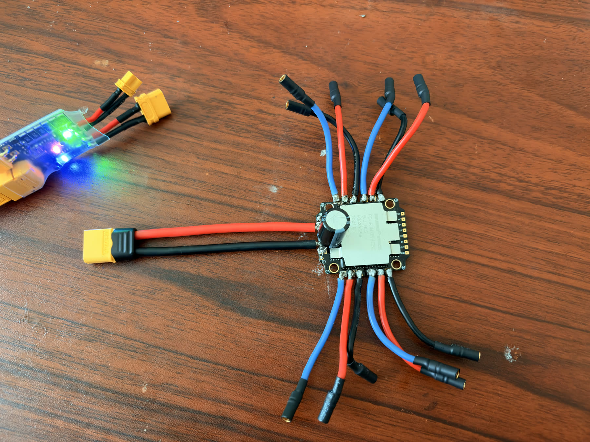
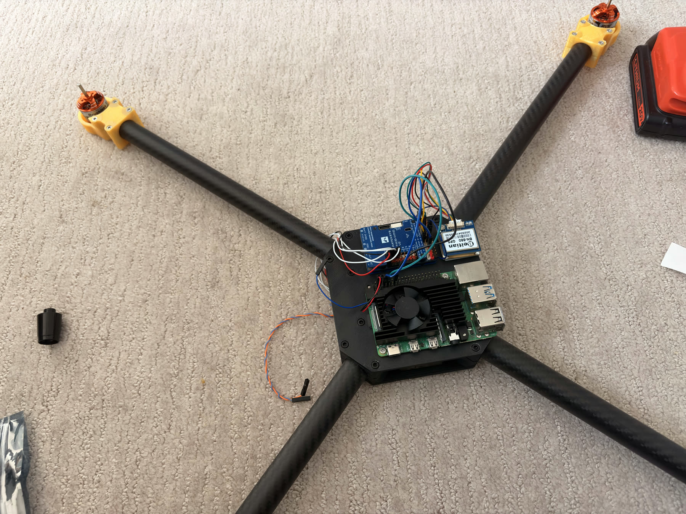
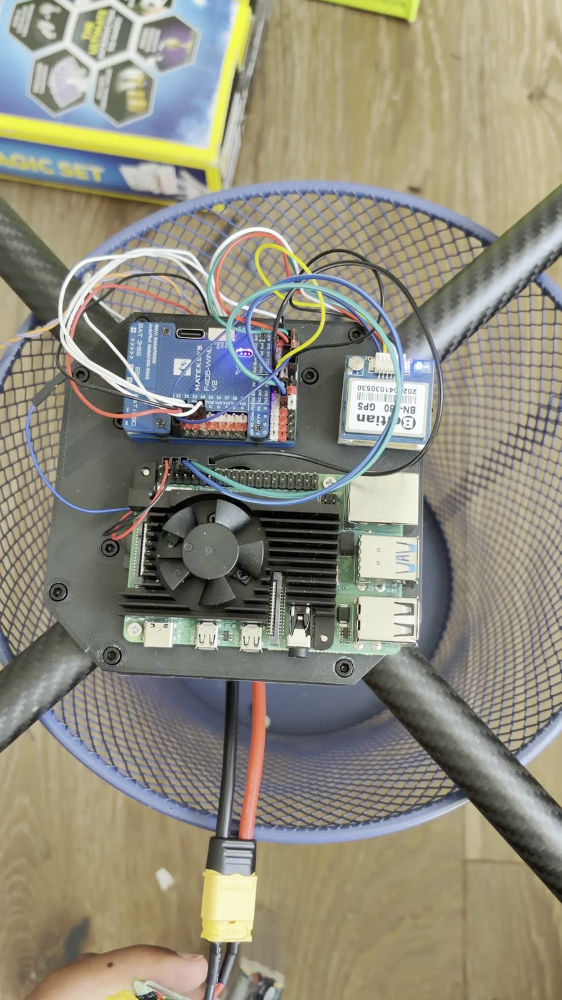

# Wiring Guide

Complete wiring reference for all connections between components.

## Overview

```
[3000mAh 4S LiPo 14.8V]
         |
    [XT60 Connector]
         |
    [Mamba F40 4-in-1 ESC]
    /    |    |    \          [Power: 16-18 AWG]
   M1   M2   M3   M4         [3x phase wires per motor, 3.5mm bullets]
         |
   [VBAT + GND to FC]        [16-18 AWG, 5-10cm]
         |
   [Matek F405-Wing V2]
    |       |       |
  UART3   I2C    UART2        [24-26 AWG signal wires]
    |       |       |
  [GPS]  [Compass] [RPi]
```

---

## 1. ESC to Flight Controller



**ESC bench-wiring reference:** use this stage to validate XT60 polarity, motor bullet connector layout, solder joints, and battery checker readings before installing propellers or mounting everything permanently.

### Power Wires (Battery Voltage to FC)

| ESC Pad | FC Pad | Wire | Notes |
|---------|--------|------|-------|
| VBAT+ | VBAT | 16-18 AWG red, 5-10cm | Battery positive |
| GND | GND | 16-18 AWG black, 5-10cm | Battery ground |

### Motor Signal Wires

| ESC Output | FC Output | Wire | Notes |
|------------|-----------|------|-------|
| M1 signal | M1 | 24-26 AWG | Front right motor |
| M2 signal | M2 | 24-26 AWG | Rear left motor |
| M3 signal | M3 | 24-26 AWG | Front left motor |
| M4 signal | M4 | 24-26 AWG | Rear right motor |
| GND | GND | 24-26 AWG | Signal ground reference |

Protocol: Dshot600 (digital, no calibration drift)

---

## 2. Motors to ESC

Each motor has 3 phase wires. Connect to the corresponding ESC motor output using 3.5mm bullet connectors.

**Initial connection order does not matter** -- if a motor spins the wrong direction, swap any 2 of the 3 wires to reverse it.

### Motor Positions and Rotation

```
        FRONT
    M3 CCW    M1 CW
        \    /
         [FC]
        /    \
    M2 CW    M4 CCW
```

| Motor | Position | Rotation | Prop Type |
|-------|----------|----------|-----------|
| M1 | Front Right | Clockwise (CW) | CW prop |
| M2 | Rear Left | Clockwise (CW) | CW prop |
| M3 | Front Left | Counter-Clockwise (CCW) | CCW prop |
| M4 | Rear Right | Counter-Clockwise (CCW) | CCW prop |

---

## 3. GPS Module to Flight Controller

The Beitian BN-880 has a 6-wire cable. It carries both GPS (UART) and compass (I2C) signals.

| GPS Wire Color | Function | FC Connection |
|----------------|----------|---------------|
| Red | +5V power | FC 5V (UART3 row) |
| Black | Ground | FC GND (UART3 row) |
| White | TX (GPS sends data) | FC RX3 / R3 |
| Green | RX (GPS receives data) | FC TX3 / T3 |
| Blue | SDA (compass I2C data) | FC SDA (I2C pad) |
| Yellow | SCL (compass I2C clock) | FC SCL (I2C pad) |

**Critical notes:**
- TX crosses to RX: GPS White (TX) goes to FC RX3, GPS Green (RX) goes to FC TX3
- GPS arrow must point forward (same as FC arrow)
- Mount GPS on 10cm mast above electronics to reduce magnetic interference
- Route GPS wires away from power wires

---

## 4. Raspberry Pi to Flight Controller

UART connection for MAVLink communication.



**Companion-computer wiring reference:** Raspberry Pi UART, GPS, and flight-controller wiring are staged on the center deck before final wire shortening and strain relief.

| Raspberry Pi Pin | Function | FC Pin |
|------------------|----------|--------|
| GPIO 14 (physical pin 8) | TX | FC RX2 (UART2 RX) |
| GPIO 15 (physical pin 10) | RX | FC TX2 (UART2 TX) |
| Pin 6 (any GND) | Ground | FC GND |

**Critical notes:**
- TX crosses to RX on this connection too
- Common ground between FC and RPi is required -- without it, UART will not work
- RPi powered separately (USB power bank or dedicated 5V BEC, not from FC 5V)
- Use 24-26 AWG signal wire, keep short (10-15cm)
- Baud rate: 921600 (configured on both FC and RPi)

### Raspberry Pi UART Pin Location

```
RPi GPIO Header (looking at board from above, USB ports on right):

Pin 1  [3.3V]  [5V]   Pin 2
Pin 3  [SDA]   [5V]   Pin 4
Pin 5  [SCL]   [GND]  Pin 6    <-- GND to FC GND
Pin 7  [GPIO4] [TX]   Pin 8    <-- TX to FC RX2
Pin 9  [GND]   [RX]   Pin 10   <-- RX to FC TX2
...
```

---

## 5. Battery Connection

| From | To | Connector | Wire |
|------|----|-----------|------|
| Battery XT60 male | ESC XT60 female | XT60 (keyed) | Built into battery/ESC |

- XT60 connectors are keyed so you cannot reverse polarity, but always double-check
- Optionally add an anti-spark XT60 inline to prevent sparking on connection
- Never connect battery with propellers installed until ready for flight

---

## Pre-Power Checklist

Before connecting the battery for the first time:

1. Use a multimeter to check for shorts between VBAT and GND on the ESC/FC
2. Verify all solder joints are clean with no bridging
3. Confirm GPS TX/RX crossover is correct
4. Confirm RPi TX/RX crossover is correct
5. Confirm motor phase wires are secure in bullet connectors
6. Ensure no bare wire is exposed anywhere
7. Remove all propellers

[](../../docs/assets/build-progress/powered-stack-test.mp4)

**Powered stack test video:** watch the 12-second no-prop bench-test clip to compare the expected powered layout, flight-controller LEDs, GPS placement, Raspberry Pi mount, and XT60/battery-checker connection before moving to motor tests.

## Wire Gauge Reference

| Connection | Gauge | Current | Purpose |
|------------|-------|---------|---------|
| Battery to ESC | 14-16 AWG | Up to 160A burst | Main power |
| ESC to FC (VBAT) | 16-18 AWG | FC draw only (~1A) | FC power |
| Motor phase wires | 16-18 AWG | Up to 40A per motor | Motor power |
| Signal wires (UART, I2C) | 24-26 AWG | milliamps | Data signals |
| GPS power | 24-26 AWG | ~50mA | GPS module |
